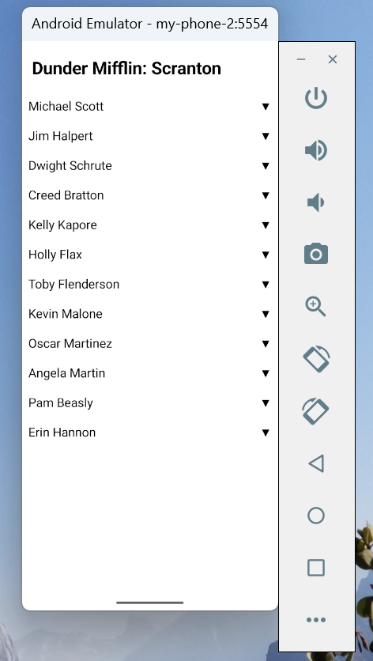
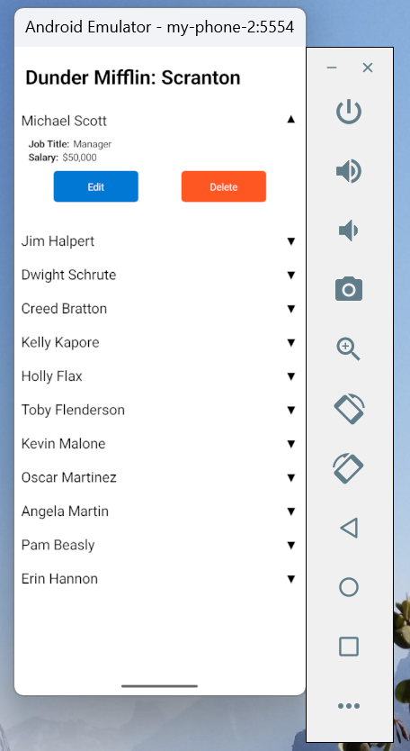
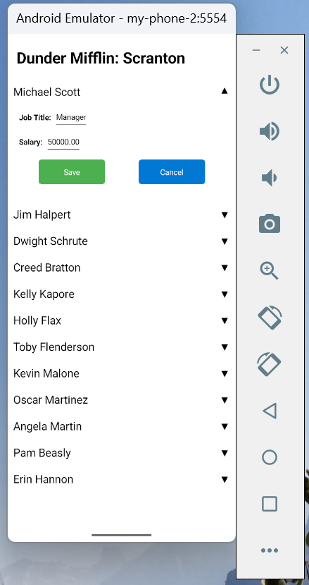

# Employee Management Mobile Application

### Set Up

- Configure TLS with a self-signed certificate

  - After cloning the project, navigate to the *api* directory, create the *certs* directory and change into the *certs* directory. Generate a self-signed certificate

    ```
    openssl req \
    -newkey rsa:2048 \
    -nodes \
    -x509 \
    -days 36500 -nodes \
    -addext "subjectAltName = IP.1:192.168.xx.xx" \
    -keyout employee_api.key \
    -out employee_api.crt
    ```

    - Replace the *subjectAltName* with the local IP address

  - Package the private key with the certificate

    ```
    openssl pkcs12 -export -out employee_api.p12 -inkey employee_api.key -in employee_api.crt -name "employee_api_cert" -passout pass:changeit
    ```

- Run the API locally

  - Navigate to the project root and start both the API and the database with Docker

    ```
    docker compose up
    ```

  - Use the browser to navigate to the URL https://localhost:8080/employees, select 'Advanced' and proceed


### Notes

- I'm having trouble registering the self-signed certificates with the MAUI application. Once this is done, the **Set Up** section will be updated with deployment instructions for the user interface.
- There is an outstanding bug that occurs when the user attempts to update an Employee's salary; specifically, when the first character is deleted. 


### Images of Application - Android Emulator







